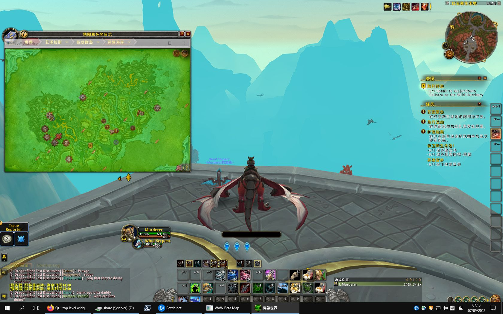

# WoW Beta Map

Temporary workaround until world map localization is complete.

## Usage

In zone list view:
* Left click: show zone map.
* Right click: show zone map that is transparent to mouse/keyboard input.
* Wheel up/down: increase/decrease opacity by 5%.

In normal zone map view:
* Right click: back to zone list.
* Wheel up/down: increase/decrease opacity by 5%.

In transparent zone map view:
* Close window: back to zone list. You may close it in window switching UI (Alt+Tab).

Hint:
* Windows user may use “Windows + Down Arrow” system shortcut to minimize window.
* Wayland user may run with `./WoWBetaMap -platform xcb` to force Xwayland mode.



## Development

1. Set up a virtual environment on Unix
   ```bash
   python3 -m venv venv
   . venv/bin/activate
   pip install -r requirements.txt
   ```
   or on Windows
   ```powershell
   python -m venv venv
   .\venv\Scripts\Activate.ps1
   pip install -r requirements.txt
   ```
1. Activate virtual environment on Unix
   ```bash
   . venv/bin/activate
   ```
   or on Windows
   ```powershell
   .\venv\Scripts\Activate.ps1
   ```
1. Run
   ```bash
   python main.py
   ```
   or build an app on Unix
   ```bash
   ./build.sh
   ```
   or build an app on Windows
   ```powershell
   .\build.ps1
   ```
